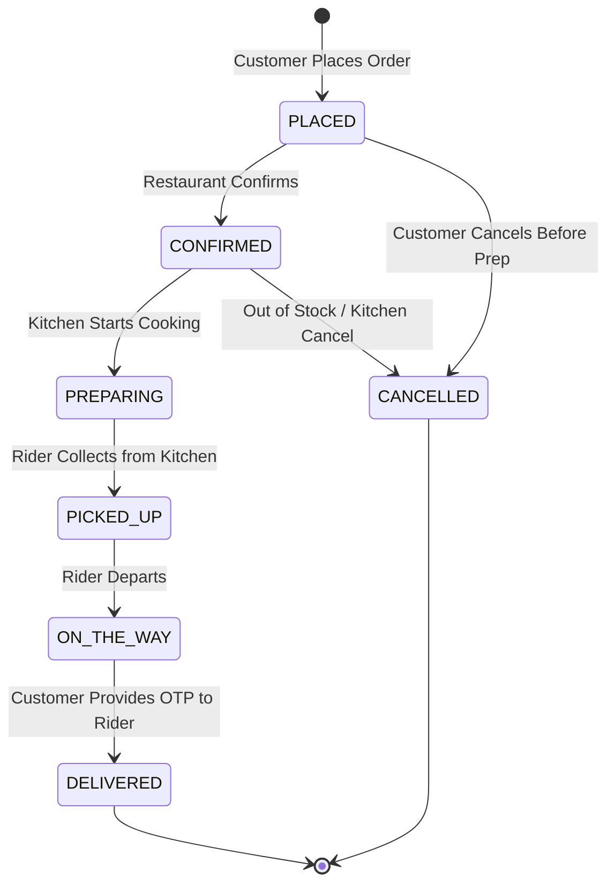

# KHABAR — Platform Security Architecture & Policy

**Tagline:** *"Your Craving. Your Choice."*  
**Platform Version:** 1.0.0 (Hardened Enterprise Release)  
**Security Standard:** OWASP Top 10:2021, OWASP API Security Top 10, Bangladesh Digital Security Act Compliance, Bangladesh Bank MFS Security Guidelines.

---

## 1. Security Overview & Philosophy

KHABAR is an on-demand food delivery and restaurant discovery platform engineered specifically for Bangladesh. Because food delivery platforms handle customer financial transactions, physical addresses, real-time rider GPS tracking, and multi-tenant restaurant financials, KHABAR implements a **Defense-in-Depth, Zero-Trust Architecture**.

### Core Tenets:
1. **Zero Client Trust:** The client browser is considered an untrusted environment. All pricing, discounts, delivery fees, order state transitions, and authorization checks are computed authoritatively on the server engine.
2. **Strict Data Segregation (Anti-BOLA/IDOR):** Restaurant partners can strictly view and mutate only their assigned kitchen data. Riders can strictly view assigned dispatches. Customers can strictly view their own orders.
3. **MFS Integrity:** Mobile Financial Services (bKash and Nagad) are processed using transactional idempotency keys. Customer PINs are **never** requested, captured, or transmitted within the application.
4. **Resilient Rate Limiting & Lockout:** Sliding-window rate limiters protect authentication, OTP generation, order placement, and coupon validation against automated brute-force attacks and credential stuffing.
5. **Tamper-Evident Auditability:** Every sensitive mutation (authentication events, rate limit breaches, price discrepancies, role violations, and refund attempts) is structured and logged with actor identity, IP, severity, and action details.

---

## 2. Threat Model & Attack Surface

| Threat Vector | Potential Impact | KHABAR Technical Mitigation |
| :--- | :--- | :--- |
| **Client-Side Price Tampering** | Attacker alters item price in browser memory (e.g. 380 BDT &rarr; 1 BDT). | Authoritative pricing engine (`orderEngine.ts`) discards client price tags and recalculates items directly from canonical catalog. |
| **BOLA / IDOR Outlet Hijacking** | Malicious restaurant partner mutates another restaurant's menu or views sales. | Strict tenant validation (`assertCanManageRestaurant`) checks `user.restaurantId === targetRestaurantId` before granting access. |
| **Delivery Fraud & Ghost Delivery** | Dishonest rider marks order as delivered without reaching customer. | Mandatory 4-digit cryptographically random Delivery OTP (`deliveryOTP`) generated at order time; rider app requires OTP verification before DELIVERED transition. |
| **Voucher Brute-Force & Replay** | Attacker repeatedly applies promo codes or bypasses single-use limits. | Sliding-window coupon limiter (8 req/min) + persistent per-customer redemption ledger (`couponEngine.ts`). |
| **Credential Stuffing & Brute Force** | Automated dictionary attacks against customer and admin accounts. | Progressive lockout (5 failed attempts locks account for 15 minutes) + sliding-window rate limiting on login/OTP endpoints. |
| **MFS PIN Phishing / Interception** | Untrusted apps capturing user's 5-digit bKash/Nagad PIN. | Elimination of in-app PIN inputs. 1-Tap compliant MFS sandbox simulator with idempotency keys and server verification. |
| **Cross-Site Scripting (XSS)** | Stored or reflected malicious payloads in restaurant reviews, addresses, or names. | Strict HTML entity escaping (`sanitizeHtml`), dangerous tag and event handler stripping (`stripDangerousContent`), and Content Security Policy (CSP). |
| **Clickjacking / UI Redress** | Malicious sites framing the portal inside an iframe to hijack user clicks. | `X-Frame-Options: DENY` and CSP `frame-ancestors 'none'` in `vercel.json` and `index.html`. |

---

## 3. Cryptographic Architecture

KHABAR utilizes modern W3C Web Cryptography Standards (`window.crypto.subtle` / `globalThis.crypto.subtle`):

### 3.1 Password Hashing (PBKDF2)
- **Algorithm:** PBKDF2 with SHA-256 HMAC (`pbkdf2_sha256`).
- **Iterations:** 100,000 iterations (conforming to NIST SP 800-132 recommendations).
- **Salt:** 16 bytes (128 bits) of cryptographically secure random bytes generated via `crypto.getRandomValues()`.
- **Serialized Format:** `pbkdf2_sha256$<iterations>$<salt_hex>$<derived_key_hex>`
- **Storage:** No plaintext passwords are ever persisted or logged.

### 3.2 Dynamic One-Time Passwords (OTP)
- **Entropy:** Generated using CSPRNG `crypto.getRandomValues()`.
- **Format:** 4-digit numeric code (`1000` to `9999`).
- **Validity Window:** 120 seconds (2 minutes).
- **Max Verification Attempts:** 3 attempts per OTP before automatic invalidation.

### 3.3 Timing Attack Resistance
- All sensitive string comparisons (session tokens, webhook signatures, OTP verification) utilize `timingSafeEqual()` with bitwise XOR accumulation (`acc |= a.charCodeAt(i) ^ b.charCodeAt(i)`) to prevent side-channel timing analysis.

---

## 4. Role-Based Access Control (RBAC) Matrix

KHABAR enforces a centralized 4-tier Role-Based Access Control matrix (`src/security/rbac.ts`):

```
+----------------------------------------------------------------------------------------------------+
|                                    KHABAR RBAC PERMISSION MATRIX                                   |
+------------------------------------+----------+---------------------+---------------+--------------+
| Action / Permission                | CUSTOMER | RESTAURANT PARTNER  | RIDER COURIER | SUPER ADMIN  |
+------------------------------------+----------+---------------------+---------------+--------------+
| BROWSE_CATALOG                     |   YES    |         YES         |      YES      |     YES      |
| PLACE_ORDER                        |   YES    |         NO          |      NO       |     YES      |
| CANCEL_OWN_ORDER                   |   YES    |         NO          |      NO       |     YES      |
| VIEW_OWN_ORDER                     |   YES    |         NO          |      NO       |     YES      |
| MANAGE_OWN_CART                    |   YES    |         NO          |      NO       |     YES      |
| SUBMIT_ORDER_REVIEW                |   YES*   |         NO          |      NO       |     YES      |
| VIEW_OUTLET_KDS                    |    NO    |     YES (OWN ONLY)  |      NO       |     YES      |
| CONFIRM_OUTLET_ORDER               |    NO    |     YES (OWN ONLY)  |      NO       |     YES      |
| PREPARE_OUTLET_ORDER               |    NO    |     YES (OWN ONLY)  |      NO       |     YES      |
| MANAGE_OUTLET_MENU                 |    NO    |     YES (OWN ONLY)  |      NO       |     YES      |
| MANAGE_OUTLET_STOCK                |    NO    |     YES (OWN ONLY)  |      NO       |     YES      |
| VIEW_ASSIGNED_DELIVERY             |    NO    |         NO          |      YES      |     YES      |
| COMPLETE_DELIVERY_WITH_OTP         |    NO    |         NO          |      YES      |     YES      |
| MANAGE_RIDER_DUTY                  |    NO    |         NO          |      YES      |     YES      |
| ADMIN_ACCESS_CONSOLE               |    NO    |         NO          |      NO       |     YES      |
| ADMIN_MANAGE_ALL_RESTAURANTS       |    NO    |         NO          |      NO       |     YES      |
| ADMIN_REFUND_TRANSACTIONS          |    NO    |         NO          |      NO       |     YES      |
| ADMIN_VIEW_AUDIT_LOGS              |    NO    |         NO          |      NO       |     YES      |
+------------------------------------+----------+---------------------+---------------+--------------+
* Verified Delivery Required: Reviews can only be submitted for completed orders.
```

### Portal Role Gating (`RoleGateModal.tsx`)
Any attempt to access privileged interfaces (`/admin`, `/partner`, `/rider`) triggers an interactive cryptographic authentication challenge before access is unlocked.

---

## 5. Order State Machine & Integrity

Orders strictly adhere to a deterministic Finite State Machine (FSM):



### State Transition Safeguards:
1. **Customer Cancellation Lock:** Customers can only cancel while status is `PLACED` or `CONFIRMED`. Once the kitchen moves the order to `PREPARING`, customer cancellation is rejected.
2. **OTP Handover Verification:** The transition from `ON_THE_WAY` to `DELIVERED` strictly requires the rider to enter the customer's 4-digit `deliveryOTP`. Bypasses are rejected and logged.

---

## 6. Financial & Payment Security (MFS Bangladesh)

### 6.1 bKash and Nagad Handling
- **No PIN Entry:** In compliance with PCI-DSS and Bangladesh Bank regulations, KHABAR never renders password or PIN fields for bKash or Nagad.
- **Idempotency Keys:** Every checkout request generates a unique idempotency key (`IDEM-<TIMESTAMP>-<RANDOM>`). Duplicate submissions (double clicks or network re-transmissions) return the cached transaction response without double-charging.
- **Transaction Identifiers:** Validated payments generate tamper-evident IDs with gateway prefixes:
  - bKash: `BKH-<EPOCH_BASE36>-<TOKEN>`
  - Nagad: `NGD-<EPOCH_BASE36>-<TOKEN>`
  - Card: `CRD-<EPOCH_BASE36>-<TOKEN>`
  - Cash on Delivery: `COD-<EPOCH_BASE36>-<TOKEN>`

---

## 7. Rate Limiting Specifications

Sliding-window token limiters are deployed across key vectors (`src/security/rateLimiter.ts`):

| Endpoint / Action | Maximum Requests | Window Duration | Penalty on Breach |
| :--- | :--- | :--- | :--- |
| **Password Login** | 5 attempts | 60 seconds | 429 Blocked + Account Locked after 5 fails |
| **OTP Request** | 3 requests | 60 seconds | 60-second cooldown |
| **OTP Verification** | 3 attempts | 60 seconds | Invalidation of active OTP |
| **Order Placement** | 10 orders | 60 seconds | Anti-spam throttling |
| **Coupon Evaluation** | 8 codes | 60 seconds | Voucher enumeration prevention |
| **Review Submission** | 3 reviews | 60 seconds | Reputation poisoning defense |

---

## 8. HTTP Security Headers

Production deployments enforce strict headers via `vercel.json` and `index.html`:

```http
Content-Security-Policy: default-src 'self'; script-src 'self' 'unsafe-inline'; style-src 'self' 'unsafe-inline' https://fonts.googleapis.com; font-src 'self' https://fonts.gstatic.com data:; img-src 'self' data: blob: https://images.unsplash.com; connect-src 'self'; frame-ancestors 'none'; base-uri 'self'; form-action 'self';
X-Frame-Options: DENY
X-Content-Type-Options: nosniff
X-XSS-Protection: 1; mode=block
Referrer-Policy: strict-origin-when-cross-origin
Permissions-Policy: camera=(), microphone=(), geolocation=(self), payment=(self)
Strict-Transport-Security: max-age=63072000; includeSubDomains; preload
```

---

## 9. Audit Logging & SIEM Integration

The platform maintains a structured security log buffer (`src/security/auditLogger.ts`):
- **Severities:** `INFO`, `WARNING`, `CRITICAL`.
- **Logged Events:**
  - `AUTH_LOGIN_SUCCESS`, `AUTH_LOGIN_FAILED`, `AUTH_LOGOUT`, `AUTH_ACCOUNT_LOCKED`
  - `RBAC_ACCESS_DENIED`, `BOLA_ACCESS_DENIED`
  - `RATE_LIMIT_EXCEEDED`
  - `ORDER_PRICE_TAMPERED`, `ORDER_STATE_INVALID`
  - `COUPON_REJECTED`, `COUPON_REUSE_BLOCKED`
  - `PAYMENT_VERIFIED`, `PAYMENT_REFUND_BLOCKED`
- **Admin Visibility:** Administrators can filter, search, inspect actor details, and export audit trails via the Security tab in the Admin Console.

---

## 10. Vulnerability Disclosure Policy

If you discover a security vulnerability in the KHABAR platform:
1. **Contact:** Email `security@khabar.com.bd` with full steps to reproduce.
2. **PGP Key:** Available upon request for encrypted communications.
3. **Response Time:** Initial acknowledgment within 24 hours; remediation assessment within 72 hours.
4. **Responsible Disclosure:** We ask that security researchers refrain from data exfiltration, service disruption, or public disclosure until a patch has been deployed.
