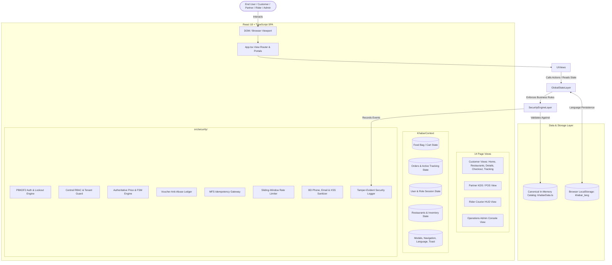
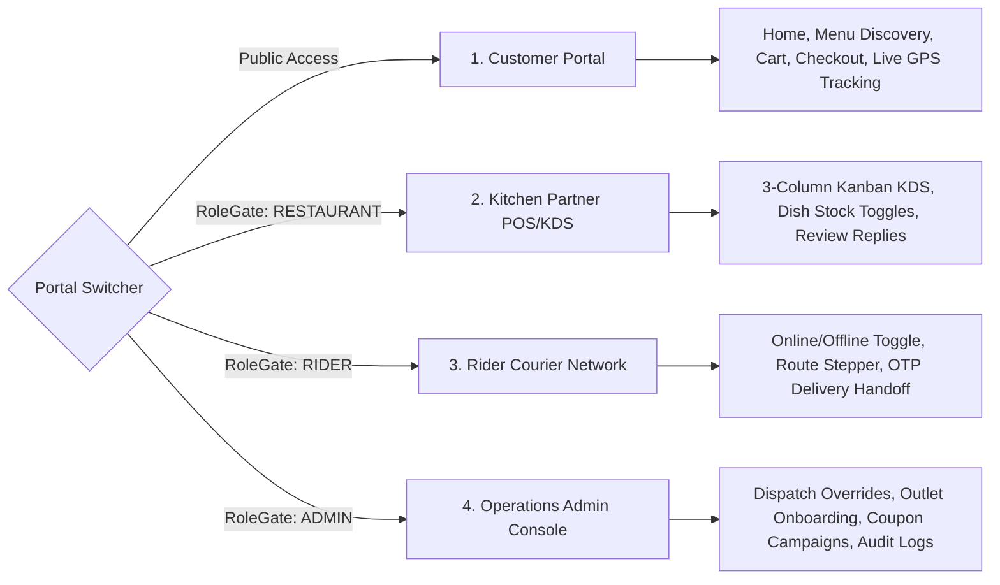
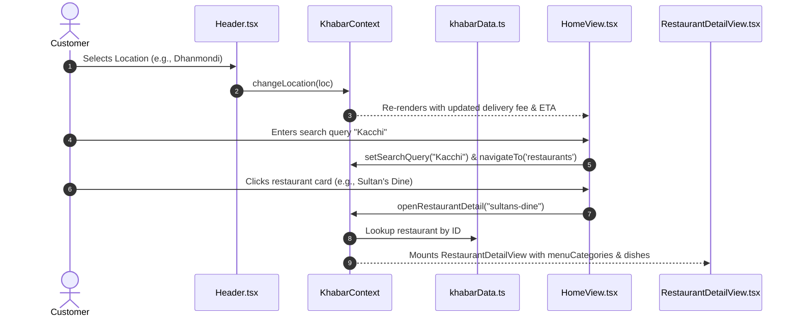
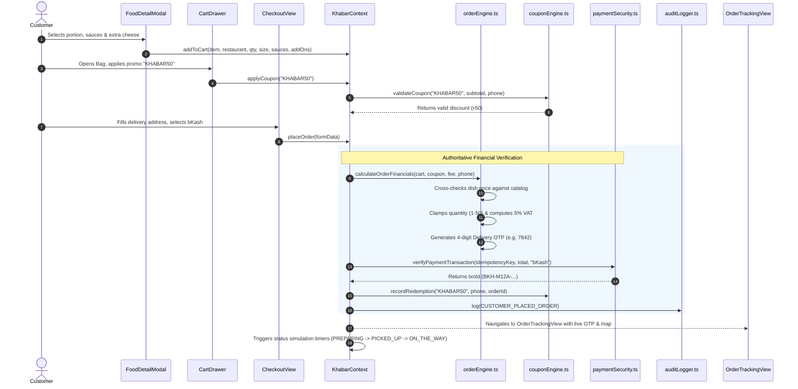
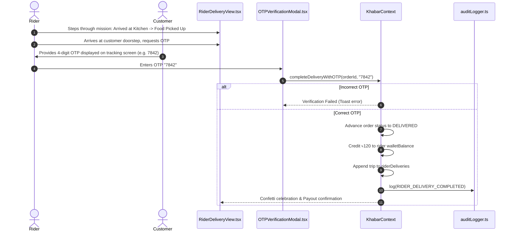
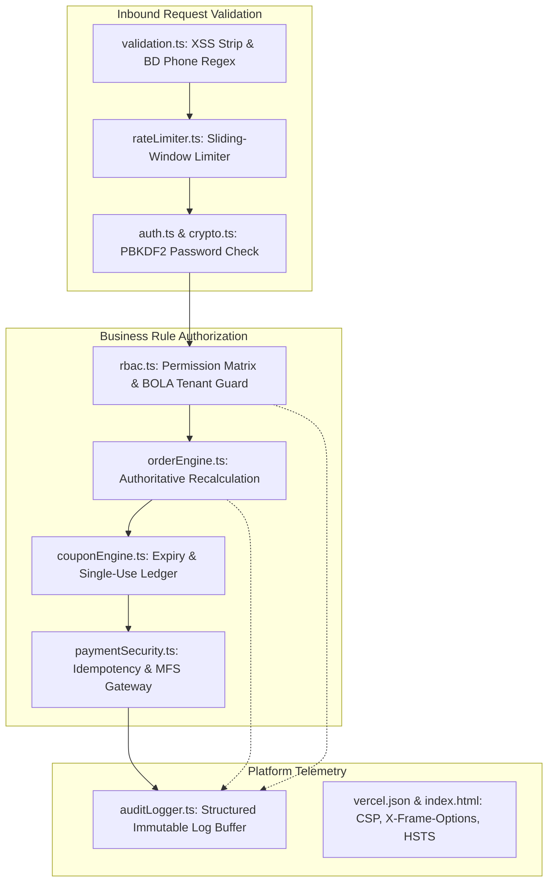
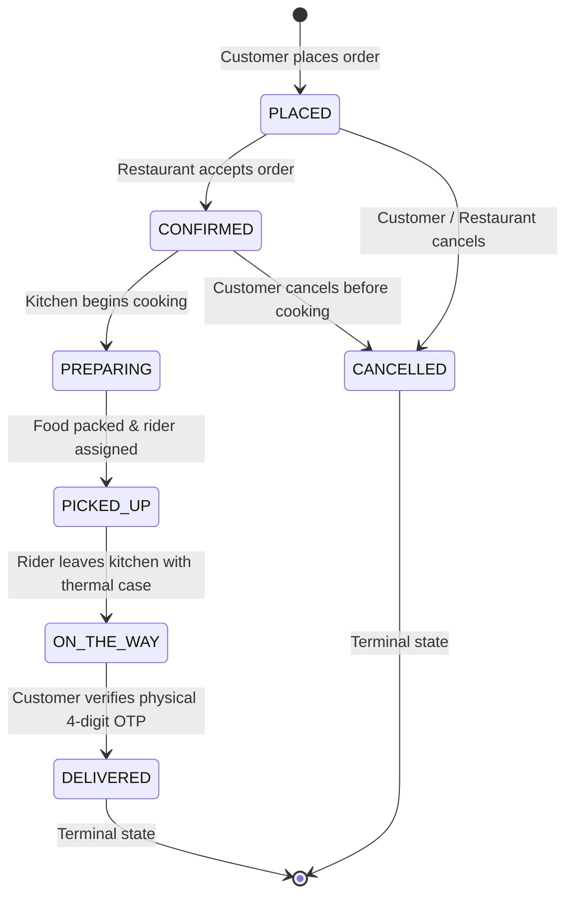

# KHABAR — System Architecture & Technical Specification
**Platform:** KHABAR — Restaurant & Food Delivery Platform  
**Architecture Grade:** Enterprise-Hardened Client-Side SPA  
**Document:** System Architecture, Data Flow, Security Matrix & Operations Manual  
**Market:** Bangladesh (Dhaka, Chattogram, Sylhet)  
**Author:** Senior Full-Stack Architect, DevSecOps Lead & Systems Engineer

---

## 1. System Architecture Overview

KHABAR is architected as a **high-performance, client-side Single Page Application (SPA)** built with React 18, TypeScript 5, Vite 6, and Tailwind CSS. 

Because the project currently operates without a remote backend server or remote database, all business rules, financial validations, role gates, and state machines are implemented as **authoritative client-side security engines** located in `src/security/`.

### High-Level Architecture Diagram



### Architectural Realism & Ground Truth Notice
> [!IMPORTANT]
> **No Remote Database or Backend Server Exists in Current Codebase:**
> There is no external PostgreSQL, MongoDB, MySQL, Firebase Firestore, or Prisma ORM connected.
> Data is held in **reactive in-memory state**, seeded at launch from `src/data/khabarData.ts`.
> The system simulates server-authoritative behavior via `src/security/orderEngine.ts`, `src/security/auth.ts`, and `src/security/rbac.ts`.

---

## 2. Multi-Portal Business Ecosystem

The application supports four distinct user personas through a unified codebase:



### Pre-Configured Role Credentials (PBKDF2-Hashed in `src/security/auth.ts`)
| Portal | Role Identifier | Email | Password | Access Boundary |
| :--- | :--- | :--- | :--- | :--- |
| **Customer** | `CUSTOMER` | `tanvir@khabar.com` | `Khabar@2026` | Own cart, own orders, table bookings |
| **Admin** | `ADMIN` | `admin@khabar.com` | `KhabarAdmin@2026` | Global override, all outlets, refunds, audit logs |
| **Kitchen Partner** | `RESTAURANT` | `partner@takeout.com` | `KhabarPartner@2026` | Strictly scoped to `restaurantId: 'takeout'` |
| **Rider Courier** | `RIDER` | `rider@khabar.com` | `KhabarRider@2026` | Scoped to assigned delivery trips |

---

## 3. End-to-End Data Flows

### A. Restaurant Discovery & Browsing Flow


### B. Complete Order Lifecycle Flow (Server-Authoritative)


### C. Rider Physical Delivery & OTP Verification Flow


---

## 4. State Management Architecture (`KhabarContext.tsx`)

The state architecture is encapsulated within a single unified React Context provider (`KhabarProvider`) exposing the `useKhabar()` hook.

### Key State Groups

```text
KhabarState
│
├── Localization
│   ├── language: 'en' | 'bn'
│   └── t: TranslationStrings
│
├── Navigation & Routing
│   ├── currentView: KhabarView ('home', 'restaurants', 'admin', etc.)
│   └── portalMode: 'customer' | 'admin' | 'partner' | 'rider'
│
├── Security & Role Gate
│   ├── authenticatedUser: AuthenticatedUser | null
│   ├── user: UserProfile
│   └── roleGateState: { isOpen: boolean, targetRole: UserRole }
│
├── Food Discovery & Filtering
│   ├── selectedLocation: LocationItem
│   ├── searchQuery: string
│   ├── selectedCategory: string
│   ├── sortBy: 'recommended' | 'rating' | 'fastest' | 'price-asc' | 'price-desc'
│   ├── cuisineFilters: string[]
│   └── budgetFilter: number | null
│
├── Cart & Financials (Authoritatively Computed)
│   ├── cart: CartItem[]
│   ├── appliedCoupon: PromoCoupon | null
│   ├── subtotal: number
│   ├── discount: number
│   ├── deliveryFee: number
│   ├── vat: number
│   └── total: number
│
├── Orders & Tracking
│   ├── orders: OrderRecord[]
│   └── activeTrackingOrder: OrderRecord | null
│
├── Partner Operations
│   ├── activePartnerRestaurantId: string
│   └── inventory: InventoryItem[]
│
├── Rider Fleet
│   ├── riderOnline: boolean
│   ├── incomingDelivery: OrderRecord | null
│   ├── activeRiderStep: number (1..4)
│   ├── walletBalance: number
│   └── riderDeliveries: RiderDeliveryRecord[]
│
└── Platform Governance
    ├── pendingRestaurants: PendingRestaurant[]
    ├── coupons: PromoCoupon[]
    ├── transactions: PaymentTransaction[]
    └── auditLogs: AuditLogEntry[]
```

---

## 5. Security Architecture Matrix (10 Engines)



### Security Defenses Implemented in Codebase

| Threat / Vulnerability | Neutralization Mechanism | Code Location | Status |
| :--- | :--- | :--- | :--- |
| **Client-Side Price Tampering** | Recomputes totals from catalog; ignores client-supplied prices | `src/security/orderEngine.ts` | **Active & Enforced** |
| **Broken Object-Level Authorization (BOLA/IDOR)** | Restricts kitchen actions strictly to user's assigned `restaurantId` | `src/security/rbac.ts` | **Active & Enforced** |
| **Credential Stuffing & Brute Force** | Locks account for 15 min after 5 failed login attempts | `src/security/auth.ts` | **Active & Enforced** |
| **Timing Attacks on Cryptography** | Constant-time string comparison (`timingSafeEqual`) | `src/security/crypto.ts` | **Active & Enforced** |
| **Delivery Rider Fraud** | Requires customer 4-digit physical OTP before marking DELIVERED | `src/security/orderEngine.ts`, `KhabarContext.tsx` | **Active & Enforced** |
| **Voucher Replay / Abuse** | Single-use ledger tracking redemptions by customer phone number | `src/security/couponEngine.ts` | **Active & Enforced** |
| **Double Charging / Payment Replay** | Idempotency key tracking in in-memory Set | `src/security/paymentSecurity.ts`| **Active & Enforced** |
| **MFS PIN Interception** | Prohibits collecting bKash/Nagad PINs inside app | `src/security/paymentSecurity.ts`| **Active & Enforced** |
| **Cross-Site Scripting (XSS)** | Control character escaping & script tag stripping | `src/security/validation.ts` | **Active & Enforced** |
| **Malicious File Uploads** | 5 MB cap, MIME type whitelist (`image/jpeg, png, webp`) | `src/security/fileSecurity.ts` | **Active & Enforced** |
| **Burst Traffic / API Flooding** | Sliding-window in-memory rate limiter per action type | `src/security/rateLimiter.ts` | **Active & Enforced** |
| **Security Audit Trails** | Structured, tamper-evident log buffer capped at 500 entries | `src/security/auditLogger.ts` | **Active & Enforced** |

---

## 6. Order Finite State Machine (FSM)

Order state transitions follow a strict directed graph enforced in `src/security/orderEngine.ts`:



### Transition Authorization Matrix
- `PLACED` → `CONFIRMED`: Authorized for `RESTAURANT`, `ADMIN`.
- `CONFIRMED` → `PREPARING`: Authorized for `RESTAURANT`, `ADMIN`.
- `PREPARING` → `PICKED_UP`: Authorized for `RESTAURANT`, `ADMIN`, `RIDER`.
- `PICKED_UP` → `ON_THE_WAY`: Authorized for `RIDER`, `ADMIN`.
- `ON_THE_WAY` → `DELIVERED`: Strictly requires **4-Digit Customer OTP** verified by `RIDER` or `ADMIN`.
- Any state → `CANCELLED`: Only permitted before food preparation begins (`PLACED` or `CONFIRMED`).

---

## 7. Build, Packaging & Deployment Architecture

```mermaid
graph LR
    Dev[Local Developer Workspace] -->|git push origin main| GitHub[GitHub Repository]
    GitHub -->|Webhook Trigger| Vercel[Vercel CI/CD Pipeline]
    
    subgraph Vercel Build Environment
        Install[npm install dependencies]
        TypeCheck[tsc -b TypeScript Compilation]
        ViteBuild[vite build Bundler & Tree-shaking]
        Output[Generate /dist Directory]
        Install --> TypeCheck --> ViteBuild --> Output
    end

    Vercel --> Install
    Output --> EdgeCDN[Vercel Global Edge Network]
    EdgeCDN --> SecurityHeaders[Inject vercel.json Defense Headers]
    SecurityHeaders --> Browser[End User Browser]
```



### Production Security Headers (`vercel.json`)
The deployment configuration in `vercel.json` applies HTTP defense headers:
- `X-Frame-Options: DENY` (prevents clickjacking attacks)
- `X-Content-Type-Options: nosniff` (prevents MIME type sniffing)
- `X-XSS-Protection: 1; mode=block`
- `Referrer-Policy: strict-origin-when-cross-origin`
- `Permissions-Policy: camera=(), microphone=(), geolocation=(self), payment=(self)`
- `Strict-Transport-Security: max-age=63072000; includeSubDomains; preload` (enforces HTTPS)
- `Content-Security-Policy: default-src 'self'; script-src 'self' 'unsafe-inline'; style-src 'self' 'unsafe-inline' https://fonts.googleapis.com; font-src 'self' https://fonts.gstatic.com data:; img-src 'self' data: blob: https://images.unsplash.com; connect-src 'self'; frame-ancestors 'none';`

---

## 8. Environment Variables Specification

As defined in `.env.example`:

| Environment Variable | Classification | Purpose | Code Usage |
| :--- | :--- | :--- | :--- |
| `VITE_APP_NAME` | Public Client | Application display name ("KHABAR") | Header, Document Title |
| `VITE_APP_TAGLINE` | Public Client | Marketing tagline | Footer, Meta tags |
| `VITE_DEFAULT_LOCALE` | Public Client | Initial language fallback ("en") | `KhabarContext.tsx` |
| `VITE_API_BASE_URL` | Public Client | Future REST API gateway URL | API clients |
| `VITE_PBKDF2_ITERATIONS`| Client Security | Hashing complexity iterations (`100000`) | `crypto.ts` |
| `VITE_SESSION_EXPIRY_HOURS`| Client Security | Session timeout duration (`24`) | `auth.ts` |
| `VITE_MAX_LOGIN_ATTEMPTS` | Client Security | Max failed logins before lockout (`5`)| `auth.ts` |
| `VITE_LOCKOUT_DURATION_MINUTES`| Client Security | Lockout penalty window (`15` min) | `auth.ts` |
| `VITE_BKASH_MERCHANT_NAME`| Public Client | bKash checkout branding | `CheckoutView.tsx` |
| `VITE_BKASH_MERCHANT_NUMBER`| Public Client | bKash official merchant number | `CheckoutView.tsx` |
| `VITE_NAGAD_MERCHANT_NAME` | Public Client | Nagad checkout branding | `CheckoutView.tsx` |
| `VITE_NAGAD_MERCHANT_NUMBER`| Public Client | Nagad official merchant number | `CheckoutView.tsx` |
| `VITE_RATE_LIMIT_LOGIN_MAX`| Client Security | Max logins per minute (`5`) | `rateLimiter.ts` |
| `VITE_RATE_LIMIT_ORDER_MAX`| Client Security | Max orders per minute (`3`) | `rateLimiter.ts` |
| `VITE_RATE_LIMIT_COUPON_MAX`| Client Security | Max coupon tests per minute (`10`)| `rateLimiter.ts` |
| `VITE_DEFAULT_CITY` | Public Client | Fallback city name ("Dhaka") | `LocationModal.tsx` |
| `VITE_DEFAULT_LAT` / `LNG`| Public Client | Center coordinates for Dhaka map | `OrderTrackingView.tsx` |

> [!CAUTION]
> Production payment secrets (`BKASH_APP_SECRET`, `BKASH_HMAC_SECRET`, `NAGAD_PRIVATE_KEY`, `JWT_SIGNING_KEY`) are kept strictly off the client-side bundle and must only reside in future serverless/backend runtimes.
